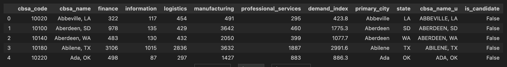
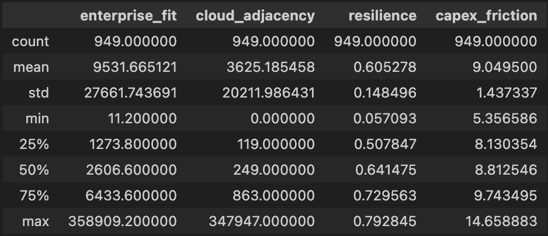

# Executive Summary, Methodology, and Limitations
*(Notebook 01 — Dataset Build | Notebook 02 — Scoring & Sensitivity)*

---

## Purpose
**What this workflow is doing**
- Builds a **market prioritization lens** for **Flo Networks** by converting **public economic activity data** into **metro-level demand proxies**.
- Ranks U.S. metros (CBSAs) using:
  - A **Baseline Demand Rank** (demand only), and
  - A **Flo Score** (demand + enterprise fit + cloud adjacency + resilience − capex friction)

**Why it matters**
- Produces a **repeatable shortlist generator** that helps Flo focus diligence (pricing, ROW/capex, competitive density, anchor customers, DC/IXP adjacency) on the most promising metros first.

---

## What you get at the end
**Primary processed dataset**
- `data/processed/market_features.csv`  
  A “CBSA universe” table (in your run: ~949 metros) with:
  - CBSA code + name
  - Employment buckets by NAICS group
  - A computed `demand_index`
  - Candidate tagging (`is_candidate`) if configured

**Decision outputs (Notebook 02 exports)**
- `outputs/rankings_all.csv`  
- `outputs/rankings_candidates.csv`  
- `outputs/rankings_border_states.csv` *(CA/AZ/NM/TX corridor lens)*  
- `outputs/deliverable_scoring_table.csv` *(clean final table for sharing)*  
- `outputs/sensitivity_results.csv` *(robustness check across weights)*

---

## High-level workflow (2 notebooks)
### Notebook 01 — Build the dataset (public data → metro features)
**What it does**
1. Pulls/loads **County Business Patterns (CBP)** county-level employment data for selected NAICS buckets (your run: 2022).
2. Loads a **County → CBSA crosswalk** (county FIPS → CBSA code/name).
3. Aggregates county employment up to **metro (CBSA) level** by NAICS bucket.
4. Computes a **single demand proxy**: `demand_index`.
5. Tags “candidate metros” from `src/config.py` without filtering out the full universe.

**Why it matters**
- Converts raw county data into a single “metro feature table” that Notebook 02 can score consistently and export.

**Inputs (public / cached)**
- **CBP** (County Business Patterns) data by county and NAICS  
- A **county→CBSA crosswalk** spreadsheet  
- `src/config.py` candidate list

**Transformations**
- Employment buckets become columns (based on the NAICS groups you selected):
  - `manufacturing` (31–33)
  - `logistics` (48–49)
  - `information` (51)
  - `finance` (52)
  - `professional_services` (54)

**Demand Index**
- A **weighted sum** of bucket employment totals (a proxy for bandwidth / enterprise activity / logistics intensity).
- Interpreting it correctly: **higher `demand_index` = more economic intensity in the selected sectors**, not “guaranteed telecom demand.”

**Primary output**
- `data/processed/market_features.csv`

---

### Notebook 02 — Score, rank, and test sensitivity (features → decisions)
**What it does**
1. Loads `market_features.csv` and enforces required columns.
2. Computes:
   - `demand_norm` (min-max normalized demand)
   - A **baseline score** (`score_baseline = demand_norm`)
3. Builds **Flo-relevant proxy factors** using only the existing bucket employment columns.
4. Normalizes all factor columns.
5. Computes **`score_flo`** using weights from `src/config.py` (`BASE_WEIGHTS`).
6. Exports ranking tables + sensitivity analysis.

**Why it matters**
- Separates “raw demand” from a more Flo-oriented prioritization signal (enterprise, cloud adjacency, resilience, and a friction penalty).

---

## Scoring model (Notebook 02)

### Baseline ranking (demand-only)
**Definition**
- `score_baseline = demand_norm`

**Interpretation**
- A pure “economic intensity proxy” ranking based on your chosen NAICS buckets.

---

### Flo Score (multi-factor, using proxies)
Notebook 02 constructs four additional factors:

#### 1) Enterprise fit
**What it does**
- `enterprise_fit = 0.6·manufacturing + 0.4·logistics`

**Why it matters**
- Manufacturing + logistics-heavy metros often correlate with:
  - industrial parks / distribution hubs
  - higher enterprise connectivity potential
  - more predictable B2B demand patterns

---

#### 2) Cloud adjacency
**What it does**
- `cloud_adjacency = information`

**Why it matters**
- Information-heavy metros can signal adjacency to:
  - software/media/IT employment bases
  - higher cloud and data transport relevance  
*(Proxy only; see limitations.)*

---

#### 3) Resilience (diversification proxy)
**What it does**
- Computes sector shares across the five buckets and then:
  - `resilience = 1 − HHI(sector_shares)`
  - Higher resilience = less concentrated sector mix

**Why it matters**
- A more diversified sector base can imply:
  - more stable demand through business cycles
  - less reliance on a single sector’s volatility

---

#### 4) Capex friction (size/complexity proxy)
**What it does**
- `capex_friction = log(1 + total_emp_proxy)`

**Why it matters**
- Larger markets can be costlier/complex due to:
  - permitting/ROW complexity
  - construction and make-ready constraints
  - competitive density and access costs  
*(Still a crude proxy; see limitations.)*

---

## Weights (pulled from `src/config.py`)
**What it does**
- Notebook 02 reads `BASE_WEIGHTS` and computes:

`score_flo = Σ(weight_k × factor_k_norm)`  
*(with capex friction typically negative)*

**Why it matters**
- Makes the ranking tunable:
  - If Flo wants to bias toward enterprise/industrial corridors → increase `enterprise_fit`
  - If Flo wants to penalize build complexity more → decrease `capex_friction` further (more negative)

---

## Sensitivity analysis (stability check)
**What it does**
- Varies the weight on demand across a grid (example: 0.50 → 0.90)
- Recomputes top ranks and saves:
  - `outputs/sensitivity_results.csv`

**Why it matters**
- Identifies whether your top metros are:
  - **robust** (stay near the top across weight changes), or
  - **fragile** (jump around when weights shift)

---

## How Flo Networks could use this (practical applications)
**Shortlist generation**
- Use `rankings_all.csv` / `deliverable_scoring_table.csv` to pick a manageable set of metros for deeper diligence.

**Candidate validation**
- Use `rankings_candidates.csv` to evaluate how “known targets” compare against the broader universe.

**Border corridor lens (CA/AZ/NM/TX)**
- Use `rankings_border_states.csv` to focus on corridor logic (interconnectivity, backhaul routes, cross-border logistics, etc.).

**Investment committee narrative**
- Use the factor breakdown to justify *why* a metro ranks high:
  - demand strength vs. enterprise fit vs. resilience vs. friction penalty

---

## Key limitations (must be stated clearly)
### 1) These are proxies, not actual telecom demand
- `demand_index` reflects employment intensity in selected NAICS buckets.
- It does **not** measure:
  - contracted bandwidth
  - pricing/margins
  - competitive take rates
  - customer concentration / anchor tenants

### 2) Crosswalk + aggregation can hide local nuance
- County → CBSA aggregation can mask where demand actually clusters (specific industrial zones, DC campuses, etc.).

### 3) “Cloud adjacency” is not cloud infrastructure
- `information` employment is not the same as:
  - hyperscaler regions
  - carrier hotels
  - IXPs
  - data center inventory or absorption

### 4) “Capex friction” is a crude approximation
- Market size ≠ build cost.
- Real capex depends on:
  - ROW and permitting timelines
  - underground vs aerial mix
  - make-ready requirements
  - pole attachment processes
  - labor constraints
  - competitive density and access pricing

### 5) Weighting is subjective (by design)
- The weights reflect a prioritization philosophy, not a “truth model.”
- Sensitivity analysis exists specifically to check how much results depend on those assumptions.

---

## Recommended next upgrades (if Flo wants to operationalize)
**Data enrichment**
- Add real infra variables:
  - IXPs / carrier hotels
  - known DC inventory
  - long-haul fiber routes and hubs
  - pricing proxies (where available)
  - competitor presence (carriers, dark fiber providers)

**Market feasibility**
- Add a feasibility layer:
  - permitting risk index
  - construction complexity signals
  - municipal utility access / pole ownership structure

**Validation**
- Compare rankings against:
  - Flo’s current revenue footprint (if available)
  - known enterprise corridor markets
  - historical demand growth patterns

---

## Reproducibility and where files live
**Where to put this file**
- Keep this at: `docs/01_methodology_and_limitations.md`

**Where images should go (recommended)**
- Put generated screenshots in: `outputs/figures/`
- Reference them in Markdown with relative links, e.g.:
  - ``

**Expected run order**
1. Run Notebook 01 end-to-end → generates `data/processed/market_features.csv`
2. Run Notebook 02 end-to-end → generates `outputs/*.csv` and figures (if saved)

---
