# Notebook 02 — Scoring & Sensitivity (Results and Interpretation)

## Purpose of this notebook
This notebook takes the processed metro dataset produced by `01_build_dataset.ipynb` (`data/processed/market_features.csv`) and converts it into:

1. A **baseline ranking** driven purely by `demand_index` (normalized).
2. A **Flo Score ranking (`score_flo`)**: a weighted multi-factor score built from demand plus several Flo-relevant proxies.
3. A **score decomposition** that shows *exactly* how each factor contributes to each market’s final Flo Score.
4. A **border-state lens** (CA/AZ/NM/TX) for corridor-focused analysis.
5. A **sensitivity analysis** that tests how robust the rankings are when the demand weight changes.

The outputs are written as CSVs to `outputs/` and are intended to be used directly in writeups and slides.

---

## Inputs
### Primary input dataset
- `data/processed/market_features.csv`  
  Produced by Notebook 01. Contains one row per CBSA (metro) with:
  - Identifiers: `cbsa_code`, `cbsa_name`, `state`, (optional `primary_city`)
  - Demand signal: `demand_index`
  - Sector employment proxies: `manufacturing`, `logistics`, `information`, `finance`, `professional_services`
  - Candidate flag: `is_candidate` (TRUE/FALSE)

### Configured weights
- `src/config.py` → `BASE_WEIGHTS`  
  This dictionary is the single source of truth for how `score_flo` is computed.

**Output created for transparency:**  
- `outputs/weights_used.csv` (exported in Section 5B)
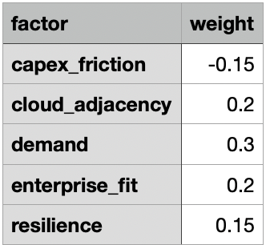
---

## Section-by-section: what happens and what it produces

## Section 0 — Pre-requisites (paths + imports)
**What it does**
- Detects the project root by searching upward until both `src/` and `data/` exist.
- Sets paths:
  - `DATA_PATH = data/processed/market_features.csv`
  - `OUT_DIR = outputs/`
- Imports `BASE_WEIGHTS` from `src.config`.

**Why it matters**
- Prevents fragile relative-path bugs.
- Ensures all exports are consistently written to `outputs/`.

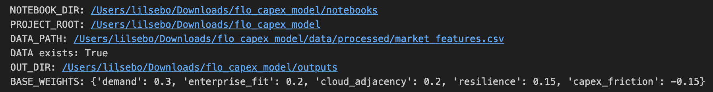

---

## Section 1 — Load dataset
**What it does**
- Reads the processed dataset into `df`.

**Expected outcome**
- `df.shape[0]` should match the full CBSA universe (example run: ~949 records).
- `df.head()` should show valid identifiers and a numeric `demand_index` with no unexpected nulls.
          

---

## Section 2 — Data quality checks
**What it does**
- Enforces required columns: `cbsa_code`, `cbsa_name`, `demand_index`.
- Coerces `demand_index` to numeric and drops invalid rows.
- Ensures `is_candidate` exists (defaults to False if missing).
- Ensures sector columns exist (defaults to 0 if missing).

**Why it matters**
- Guarantees downstream scoring never fails due to missing columns.
- Ensures the scoring is deterministic across environments/runs.

---

## Section 3 — Normalize demand + baseline ranking
**What it does**
- Creates `demand_norm` via min-max normalization across all metros.
- Defines baseline score:
  - `score_baseline = demand_norm`
- Produces `rank_baseline` (1 = highest demand).

**Interpretation**
- This ranking answers: *“If we only cared about raw demand signal, which metros rise to the top?”*
- It is your control/comparison ranking against `score_flo`.

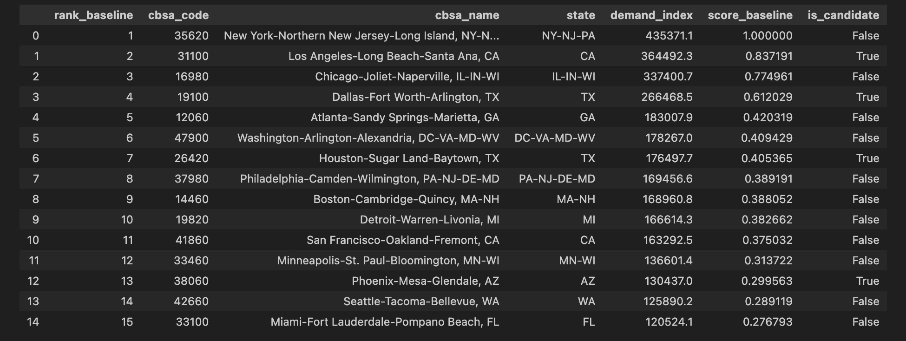

---

## Section 4 — Build Flo-relevant proxy factors
This section builds additional factors using only the fields already present in `market_features.csv`.

### 4.1 total_emp_proxy
`total_emp_proxy = manufacturing + logistics + information + finance + professional_services`

**Interpretation**
- A scale proxy for “how much addressable enterprise/knowledge workforce exists in these buckets.”

### 4.2 enterprise_fit
`enterprise_fit = 0.6 * manufacturing + 0.4 * logistics`

**Interpretation**
- Intended to approximate “industrial + logistics intensity,” which often correlates with:
  - distributed operations, supply chain nodes, warehouses, plants
  - bandwidth/transport connectivity needs

### 4.3 cloud_adjacency
`cloud_adjacency = information`

**Interpretation**
- A proxy for tech/IT-heavy metro ecosystems (data-heavy services, IT workforce concentration).

### 4.4 resilience
Resilience is computed as `1 - HHI` over the sector shares.  
- Higher value = more diversified across the selected sector buckets.

**Interpretation**
- Markets that are not overly dependent on one sector may be less cyclical / less single-point-of-failure.

### 4.5 capex_friction
`capex_friction = log1p(total_emp_proxy)`

**Interpretation**
- A proxy for “large market complexity” that can increase deployment complexity/cost:
  - more sprawl, permitting complexity, competition, infrastructure constraints, etc.
- In the Flo Score, this term is typically **negative** (a penalty).

---

## Section 5 — Normalize factors + compute Flo Score (`score_flo`)
**What it does**
- Min-max normalizes each factor:
  - `enterprise_fit_norm`
  - `cloud_adjacency_norm`
  - `resilience_norm`
  - `capex_friction_norm`
- Computes weighted score using `BASE_WEIGHTS`:

`score_flo = w_demand*demand_norm + w_enterprise*enterprise_fit_norm + ... + w_capex*capex_friction_norm`

**Interpretation**
- `score_flo` is not “revenue” or “profit.” It is a **relative prioritization score** from 0 to ~1-ish depending on weights and normalization.
- The ranking (`rank_flo`) is typically more meaningful than the raw score magnitude.

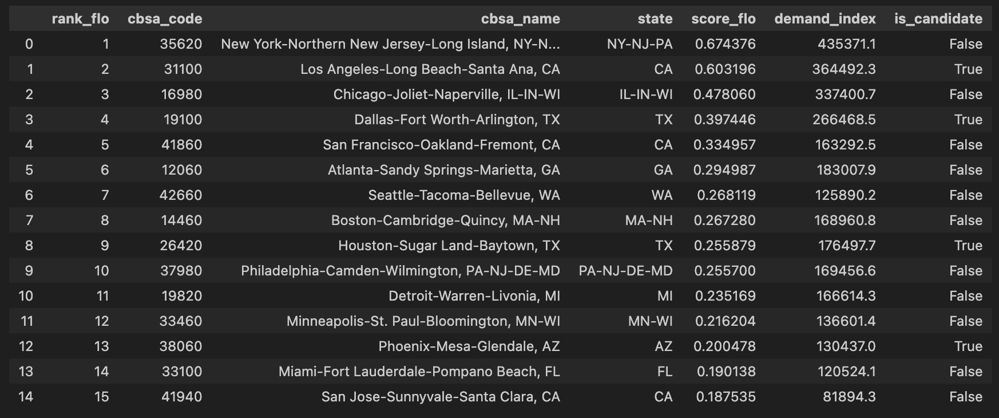

---

## Section 5B — Score decomposition (weights + contributions) + exports
This is the transparency / auditability section.

**What it produces**
1. `outputs/weights_used.csv`  
   A clean table of the weight values actually used in scoring.

2. `outputs/flo_score_decomposition_all.csv`  
   A full table with:
   - the normalized factor values
   - each factor weight `w_*`
   - each factor’s weighted contribution `contrib_*`
   - `score_flo_recalc` and `score_flo_error`

3. `outputs/flo_score_decomposition_candidates.csv`  
   Same as above, but only for `is_candidate = TRUE`.

**Critical QA check**
- Notebook prints:
  - `Max |score_flo_recalc - score_flo| = ...`
- In a correct run, this should be **0.0** (or extremely close to 0).

**How to interpret contributions**
- For any metro:
  - `score_flo = contrib_demand + contrib_enterprise_fit + contrib_cloud_adjacency + contrib_resilience + contrib_capex_friction`
- If `contrib_capex_friction` is negative, the market is being penalized for deployment complexity proxy.

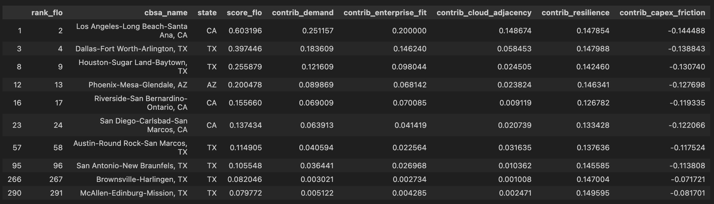

---

## Section 6 — Core exports (rankings)
**What it produces**
- `outputs/rankings_all.csv`  
  Primary ranking table for all metros.
- `outputs/rankings_candidates.csv`  
  Candidate-only subset (the markets you explicitly flagged).
- `outputs/rankings_border_states.csv`  
  Corridor slice for CA/AZ/NM/TX with `rank_border_flo`.

**How to use these files**
- `rankings_all.csv`: overall exploration and “where do the best markets sit?”
- `rankings_candidates.csv`: the short-list view (your primary “decision table”)
- `rankings_border_states.csv`: if Flo is prioritizing the Southwest corridor

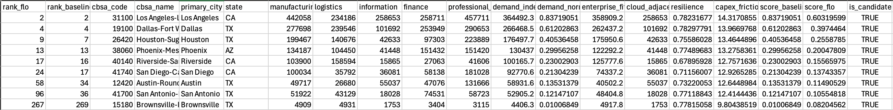

---

## Section 7 — Exhibit tables (for slides)
**What it does**
- Displays:
  - Top 10 overall by Flo Score
  - Top 10 border-state markets
  - Candidates ranked

**Interpretation**
- This is where you extract slide-ready tables (screenshots or copied tables).
- These displays should match the exported CSVs.

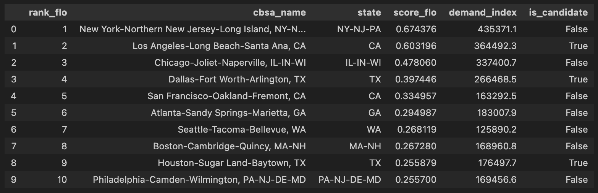
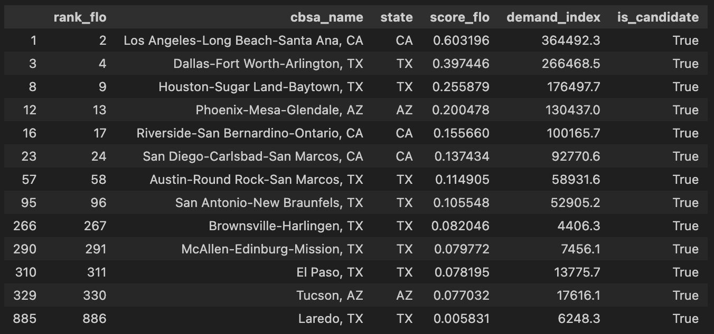

---

## Section 8 — Charts
**What it produces**
1. Histogram: distribution of `demand_index`
2. Bar chart: top 15 metros by `score_flo`
3. Bar chart: top candidate metros by `score_flo`

**Interpretation**
- The histogram shows whether demand is heavy-tailed (few very high markets vs. many mid/low).
- The bar charts show the “separation” between top ranks:
  - steep drop-offs imply a few dominant markets
  - flatter curves imply many comparable options

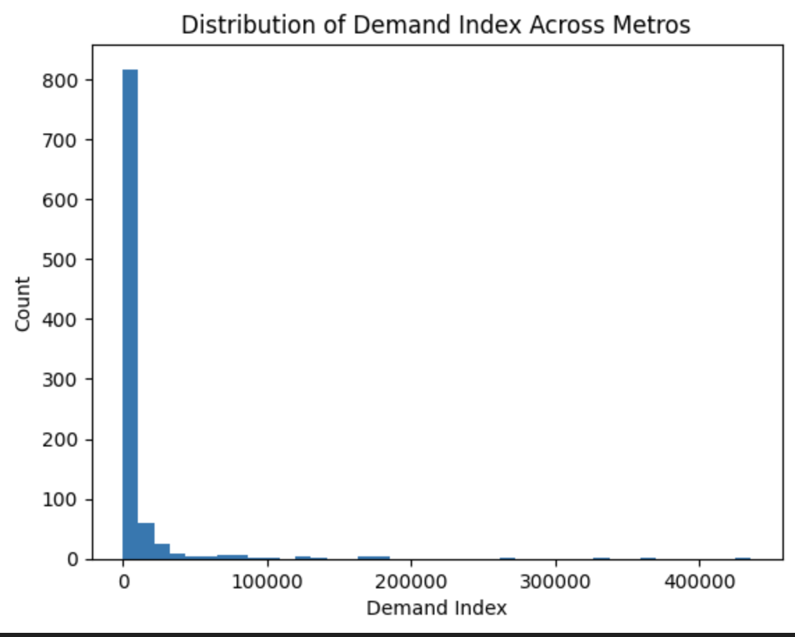
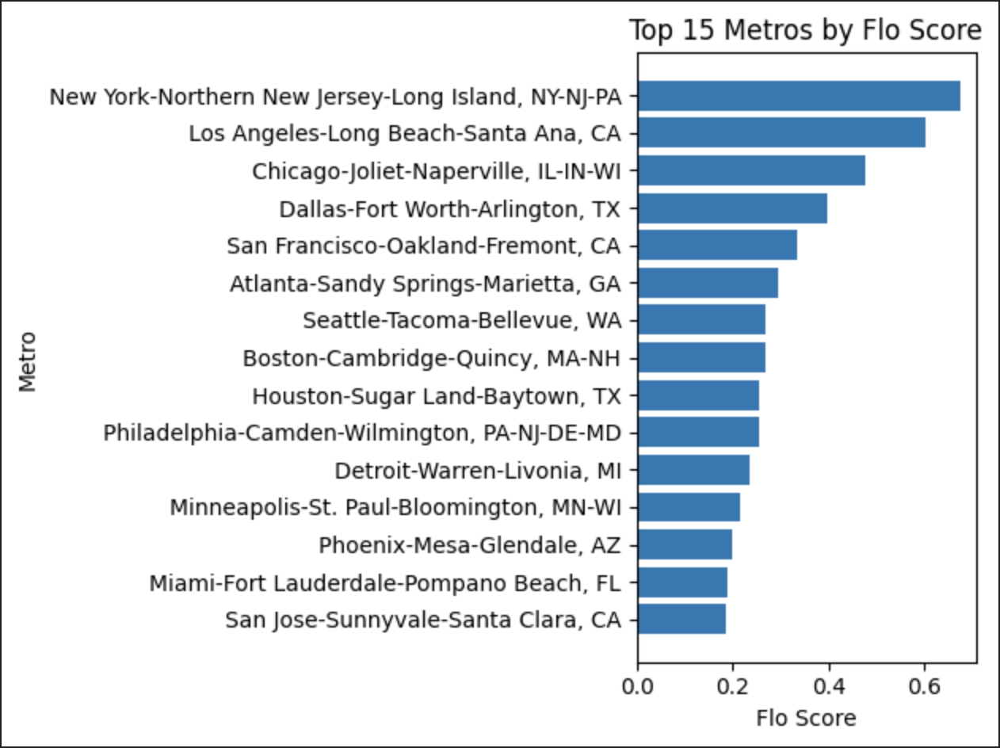
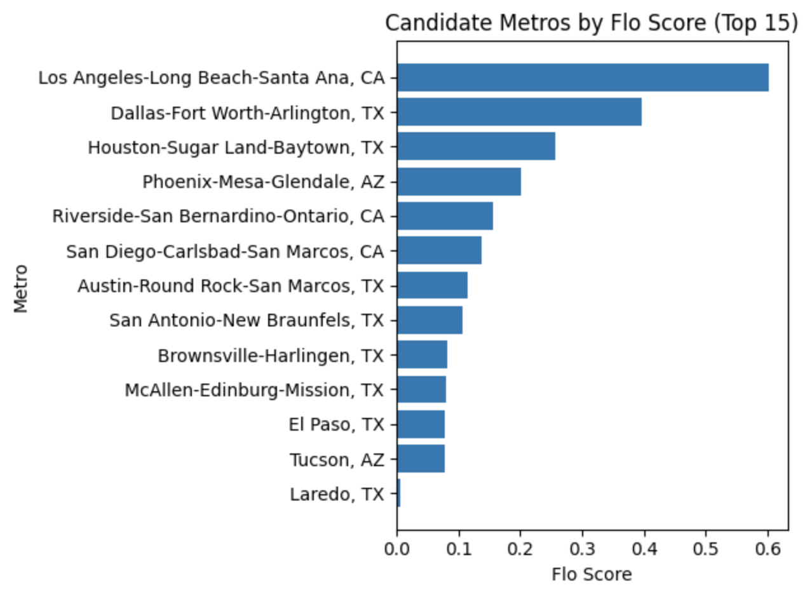

---

## Section 9 — Sensitivity analysis (vary demand weight)
**What it does**
- Sweeps `w_demand` across `[0.50, 0.60, 0.70, 0.80, 0.90]`
- Keeps other weights proportional (scaled to fill `1 - w_demand`)
- Exports:
  - `outputs/sensitivity_results.csv` (top 50 for each weight level)

**Interpretation**
- This answers: *“If we cared more/less about demand, do the same markets stay near the top?”*
- A market that stays highly ranked across many `w_demand` values is more “robust.”
- If rankings flip dramatically, it indicates the model is sensitive to weighting assumptions.

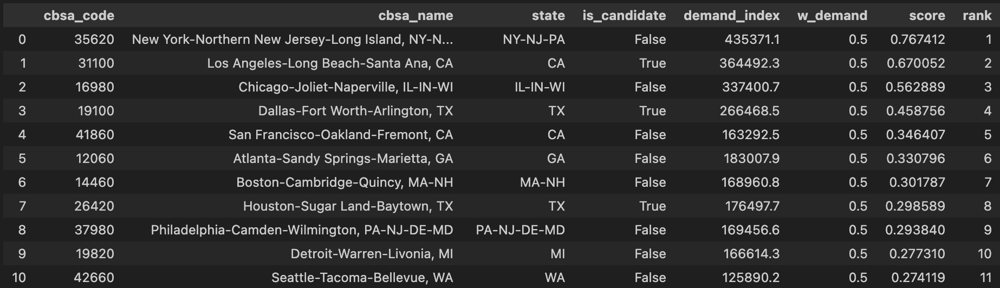

---

## Section 10 — Final deliverable export
**What it produces**
- `outputs/deliverable_scoring_table.csv`  
  A consolidated table intended to be the main “handoff” dataset.

**How to use it**
- This file is best for stakeholder delivery because it contains:
  - inputs (sector buckets, demand)
  - engineered factors
  - baseline + Flo scores
  - ranks and candidate flag

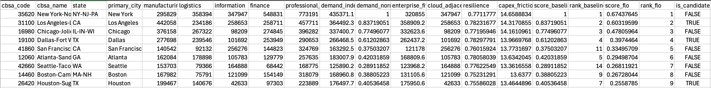

---

# Practical interpretation: what Flo Networks can do with this
This scoring system is best treated as a **market prioritization filter**—not a replacement for engineering feasibility, pricing, or customer pipeline data.

Typical uses:
1. **Targeting / expansion hypothesis list**
   - Use top-ranked candidates as a starting universe for outreach or feasibility review.
2. **“Why this market?” justification**
   - Use the decomposition tables to show *why* a market ranks high (demand-driven vs. enterprise-fit vs. resilience, etc.).
3. **Corridor strategy lens**
   - Use `rankings_border_states.csv` to focus on contiguous operational geographies.
4. **Robustness testing**
   - Use `sensitivity_results.csv` to identify markets that remain attractive even when assumptions change.

---

# Key limitations (important to state explicitly)
1. **Proxy factors are not direct measures of Flo’s actual revenue potential**
   - Sector employment and demand_index are signals, not customer contracts.
2. **Normalization makes scores relative**
   - A score is meaningful *within* this dataset, not as an absolute “probability of success.”
3. **Capex friction is simplified**
   - True capex requires network maps, permitting, competition, fiber availability, colo options, etc.
4. **No customer pipeline / competitive intel included**
   - The model should ideally be augmented with:
     - known enterprise anchors
     - hyperscaler presence
     - existing provider density
     - route/fiber adjacency
     - cost-to-build estimates

---

# Files produced by Notebook 02 (quick reference)
- `outputs/weights_used.csv`
- `outputs/flo_score_decomposition_all.csv`
- `outputs/flo_score_decomposition_candidates.csv`
- `outputs/rankings_all.csv`
- `outputs/rankings_candidates.csv`
- `outputs/rankings_border_states.csv`
- `outputs/sensitivity_results.csv`
- `outputs/deliverable_scoring_table.csv`

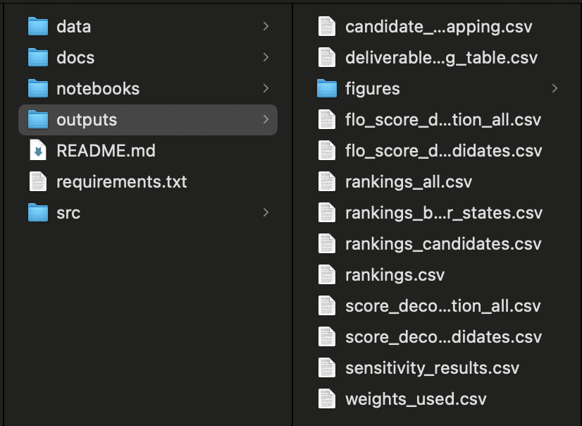
